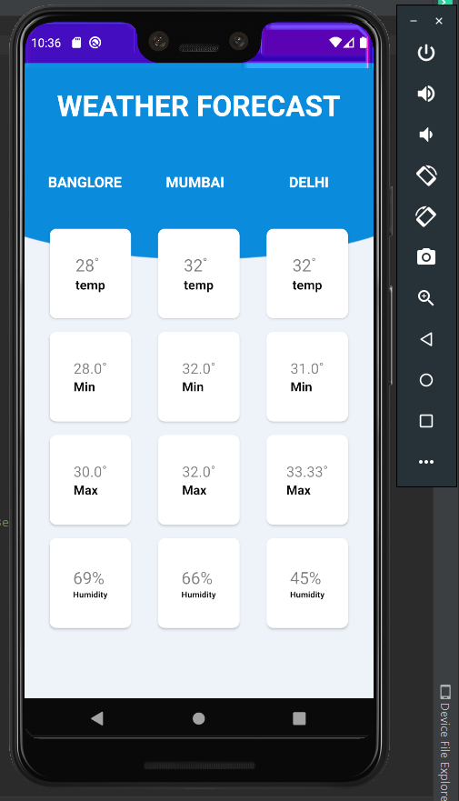

# Weather-Android-App
Android App that uses weather API

I made this app in Android Studios using Volley Library to handle HTTP requests sent by API integrated for weather frorecast.
Volley is an HTTP library that makes networking for Android apps easier and most importantly, faster. 

Open Weather Maps API used for Weather forecast.

Technologies used:
Java
Xml

App Preview :

